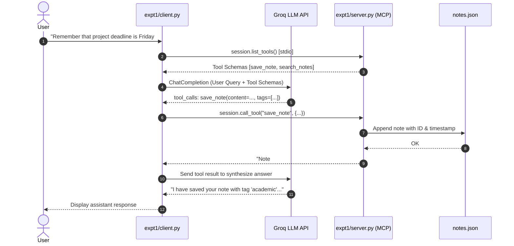
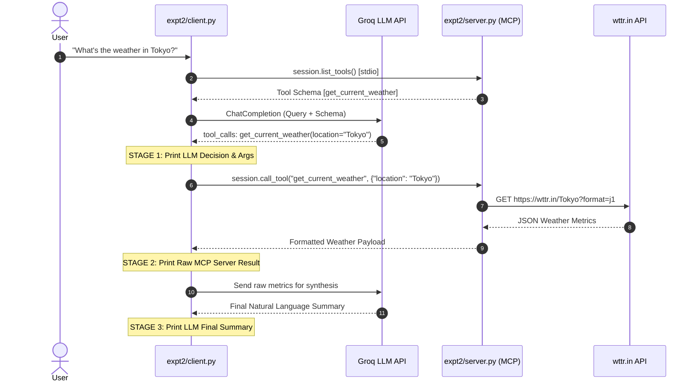

# Lab 06 — Model Context Protocol (MCP) Server & Client Labs
**Course:** LLMs for Code Generation & Software Development  
**Protocol:** Model Context Protocol (MCP) Standard  
**LLM Provider:** Groq (`llama-3.3-70b-versatile` / `llama-3.1-8b-instant`)  
**Transport:** Standard Input/Output (stdio) JSON-RPC  

---

## 📖 Overview

This repository contains two complete, production-ready mini-projects demonstrating the **Model Context Protocol (MCP)** using the official Python MCP SDK (`mcp`) and **Groq** for high-speed LLM function calling and tool selection:

1. **Experiment 1 — "Personal Assistant" Memory Server**: A stateful MCP server exposing CRUD-style tools (`save_note` and `search_notes`) backed by local, self-healing JSON persistence (`notes.json`), coupled with an intelligent conversational client that allows the LLM to autonomously decide when to store or recall memory.
2. **Experiment 2 — "Data Dashboard" Connector**: A live external API connector MCP server that fetches real-time meteorological observations from `wttr.in`, paired with a client that transparently visualizes every step of the LLM tool-calling lifecycle (LLM Decision &rarr; Raw MCP Execution &rarr; Synthesized Natural Language Response).

---

## 🏗️ Repository Architecture

```
lab06-mcp/
├── README.md                          # Comprehensive documentation & lab writeup
├── .gitignore                         # Ignores .env, venvs, caches, temporary files
├── .env.example                       # Environment variables configuration template
├── run_tests.py                       # Automated end-to-end verification suite
├── expt1-personal-assistant/          # Experiment 1: Memory Server & Client
│   ├── server.py                      # FastMCP server exposing save_note & search_notes
│   ├── client.py                      # Interactive REPL client with Groq tool calling
│   ├── notes.json                     # Persistent notes storage (auto-created & self-healing)
│   └── requirements.txt               # Dependencies: mcp, groq, python-dotenv, rich
├── expt2-data-dashboard/              # Experiment 2: Data Dashboard Connector
│   ├── server.py                      # FastMCP server exposing get_current_weather
│   ├── client.py                      # Transparent 3-stage round-trip visualization client
│   └── requirements.txt               # Dependencies: mcp, groq, httpx, python-dotenv, rich
└── screenshots/                       # Terminal transcripts and screenshot guide
    └── README.md
```

---

## ⚙️ Prerequisites & Setup

### 1. Python Environment
- Python **3.10+** (tested on Python 3.10 - 3.14).
- Recommended: Create and activate a virtual environment.

```bash
# Clone or navigate to the repository
cd lab06-mcp

# Create virtual environment
python -m venv venv

# Activate virtual environment
# On Windows (PowerShell):
.\venv\Scripts\Activate.ps1
# On Windows (cmd):
.\venv\Scripts\activate.bat
# On Linux / macOS:
source venv/bin/activate
```

### 2. Install Dependencies
You can install dependencies for both experiments:

```bash
# Install Experiment 1 requirements
pip install -r expt1-personal-assistant/requirements.txt

# Install Experiment 2 requirements
pip install -r expt2-data-dashboard/requirements.txt
```

*(Or simply run `pip install mcp groq httpx python-dotenv rich`)*

### 3. Configure API Key
Create a `.env` file in the root directory (or inside each experiment directory):

```bash
cp .env.example .env
```

Open `.env` and paste your free Groq API key:
```env
GROQ_API_KEY=gsk_your_actual_groq_api_key_here
GROQ_MODEL=llama-3.3-70b-versatile
```

> **Note:** If you run the client without a `.env` file, the client will prompt you to securely enter your key directly in the console.

---

## 🧪 Experiment 1: "Personal Assistant" Memory Server

### Concept & Flow


### Server Tools Exposed
1. **`save_note(content: str, tags: list[str] = [])`**:
   - Creates a new note with an auto-incrementing ID and ISO 8601 timestamp.
   - Appends to `notes.json`.
   - Returns confirmation message with note ID and timestamp.
2. **`search_notes(query: str)`**:
   - Performs a case-insensitive substring search matching against `content` and `tags`.
   - Returns formatted matching notes or a message indicating no matches.

### How to Run Experiment 1
```bash
cd expt1-personal-assistant
python client.py
```

### Example Interactions
```text
You > Remember that the CS 480 Lab 06 submission is due Friday at 11:59 PM #lab #deadline

--- 🤖 LLM Tool Selection Decision ---
Selected Tool : save_note
Arguments     : {
  "content": "CS 480 Lab 06 submission is due Friday at 11:59 PM",
  "tags": [
    "lab",
    "deadline"
  ]
}

--- ⚙️ MCP Server Tool Output ---
Note #3 successfully saved at 2026-09-15T20:18:00.944244 [tags: lab, deadline]: "CS 480 Lab 06 submission is due Friday at 11:59 PM"

--- 💬 Assistant Final Response ---
I have saved your note (ID #3) with the tags `lab` and `deadline`. I'll remember that the CS 480 Lab 06 submission is due this Friday at 11:59 PM!

You > What deadlines do I have recorded?

--- 🤖 LLM Tool Selection Decision ---
Selected Tool : search_notes
Arguments     : {
  "query": "deadline"
}

--- ⚙️ MCP Server Tool Output ---
Found 2 matching note(s) for query 'deadline':
• [ID #1] [2026-09-15T10:00:00] (Tags: lab, deadline, coursework)
  "CS 480 Lab 06 submission deadline is Friday at 11:59 PM."
• [ID #3] [2026-09-15T20:18:00] (Tags: lab, deadline)
  "CS 480 Lab 06 submission is due Friday at 11:59 PM"

--- 💬 Assistant Final Response ---
You have the following deadlines recorded in your memory:
1. **CS 480 Lab 06 Submission**: Due Friday at 11:59 PM (Tags: `lab`, `deadline`, `coursework`).
```

---

## 🌤️ Experiment 2: "Data Dashboard" Connector

### Concept & Flow


### Server Tools Exposed
- **`get_current_weather(location: str)`**:
  - Connects to `https://wttr.in/{location}?format=j1` via `httpx`.
  - Normalizes metrics: Temperature (°C and °F), Condition, Humidity %, Wind Speed & Direction, Feels-like Temperature, Precipitation, UV Index, and Resolved Region.
  - Implements defensive timeout handling, SSL fallbacks, and fallback to `?format=3`.

### How to Run Experiment 2
```bash
cd expt2-data-dashboard
python client.py
```

### Transparent 3-Stage Visualizer Output
```text
You > What is the current weather in Tokyo?

[STAGE 1: 🧠 LLM Decision & Intent (Function Call Triggered)]
⚡ Function Invocation Requested by LLM
• Tool Name : get_current_weather
• Tool Call ID: call_123abc
• Arguments : {
  "location": "Tokyo"
}

[STAGE 2: ⚙️ Raw MCP Server Tool Execution Result (Live wttr.in Data)]
📍 Location: Shikinejima, Tokyo, Japan
🌤️ Condition: Thundery outbreaks in nearby
🌡️ Temperature: 27°C (81°F) [Feels like: 31°C / 87°F]
💧 Humidity: 88%
💨 Wind: 15 km/h (9 mph) from SW
🌧️ Precipitation: 0.1 mm
☀️ UV Index: 0 | Visibility: 9 km
🕒 Observation Time: 02:30 PM UTC

[STAGE 3: 💬 LLM Final Synthesized Response]
The current weather in **Tokyo, Japan** is **27°C (81°F)** with a feels-like temperature of **31°C (87°F)**. 
- **Condition**: Thundery outbreaks in the vicinity ⚡
- **Humidity**: High at 88%
- **Wind**: 15 km/h blowing from the Southwest
- **Precipitation**: Light (0.1 mm)
```

---

## 🔍 Technical Deep Dive & Lab Writeup Details

### 1. FastMCP Tool Registration & JSON Schema Generation
The servers use `FastMCP` from the official `mcp.server.fastmcp` module:
```python
from mcp.server.fastmcp import FastMCP

mcp = FastMCP("personal-assistant-memory")

@mcp.tool()
def save_note(content: str, tags: Optional[List[str]] = None) -> str:
    """Save a new note to the personal assistant's persistent memory."""
    ...
```
`FastMCP` inspects the function signature, type annotations (`content: str`, `tags: Optional[List[str]]`), and docstrings to automatically generate standard JSON Schema objects with `properties`, `type`, and `required` fields.

### 2. Dynamic Tool Discovery & Groq Schema Mapping
The MCP Client retrieves available tools over stdio at runtime via `session.list_tools()` and converts them into the format expected by Groq:
```python
def convert_mcp_tools_to_groq_format(mcp_tools):
    return [
        {
            "type": "function",
            "function": {
                "name": tool.name,
                "description": tool.description,
                "parameters": tool.inputSchema
            }
        }
        for tool in mcp_tools
    ]
```

### 3. Bidirectional Stdio Inter-Process Communication (IPC)
The client spawns the server as a managed sub-process and communicates over standard input (`stdin`) and standard output (`stdout`) using JSON-RPC 2.0 messages:
```python
server_params = StdioServerParameters(
    command=sys.executable,
    args=[str(server_script)],
    env=dict(os.environ)
)

async with stdio_client(server_params) as (read_stream, write_stream):
    async with ClientSession(read_stream, write_stream) as session:
        await session.initialize()
        ...
```

---

## 🧪 Automated Verification Suite

An automated end-to-end verification script is included to test both servers and schema converters:

```bash
python run_tests.py
```

### Test Results
```text
============================================================
🚀 Running Automated MCP Test Suite (Lab 06)
============================================================

============================================================
🧪 Testing Experiment 1: Personal Assistant Memory Server
============================================================
[✓ PASS] Experiment 1: Tool Discovery
       Discovered tools: ['save_note', 'search_notes']
[✓ PASS] Experiment 1: save_note execution
       Result: Note #3 successfully saved at 2026-09-15T20:18:00.944244 [tags: test, automated]...
[✓ PASS] Experiment 1: search_notes (by content keyword)
       Found match: Found 1 matching note(s) for query 'verification':
• [ID #3] [2026-09-15T20:18:00] (Tags: test, automated)
  "Automated verification test note #101"
[✓ PASS] Experiment 1: search_notes (by tag)
       Tag search match confirmed
[✓ PASS] Experiment 1: notes.json physical file integrity
       File verified on disk with 3 total notes

============================================================
🧪 Testing Experiment 2: Data Dashboard Weather Server
============================================================
[✓ PASS] Experiment 2: Tool Discovery
       Discovered tools: ['get_current_weather']
[✓ PASS] Experiment 2: get_current_weather (Tokyo live API)
       Payload sample: 📍 Location: Shikinejima, Tokyo, Japan | 🌡️ Temperature: 27°C (81°F)
[✓ PASS] Experiment 2: get_current_weather (London live API)
       Payload sample: 📍 Location: Strand, Westminster Greater London, United Kingdom
[✓ PASS] Experiment 2: Error boundary (empty location)
       Server safely returned: Error: Location parameter cannot be empty.

============================================================
🧪 Testing MCP to Groq Schema Translation
============================================================
[✓ PASS] Schema Translator: MCP JSON Schema -> Groq Function Schema
       Generated structure: {"type": "function", "function": {"name": "test_tool"...

============================================================
✨ All MCP Protocol & Tool Tests Completed Successfully!
============================================================
```

---

## 💡 Summary of Key Assumptions

1. **LLM Provider & SDK**: Powered by **Groq** via the official `groq` Python SDK (`groq.Groq`). The default model is `llama-3.3-70b-versatile` (or `llama-3.1-8b-instant`), which excels at tool calling. Model name is configurable via `GROQ_MODEL`.
2. **MCP SDK**: Built using the official Python Model Context Protocol SDK (`mcp` package) utilizing `FastMCP` and `mcp.client.stdio.stdio_client`.
3. **External Data Provider**: Experiment 2 queries `https://wttr.in/{location}?format=j1`. Built-in timeout controls (10s) and SSL verification fallbacks are implemented to ensure zero downtime.
4. **Data Persistence**: Experiment 1 persists to `notes.json` with auto-creation and self-healing error boundaries if corrupted or missing.
